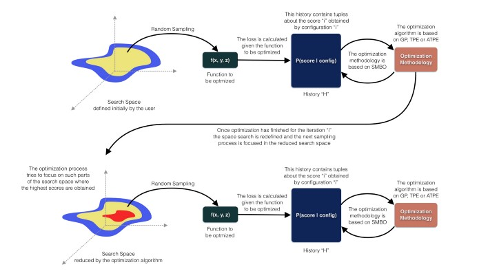
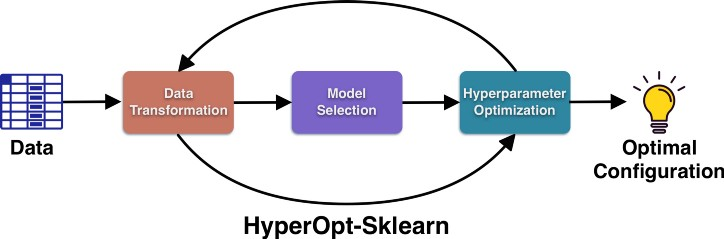

# AutoML: Reporte

## HyperOpt: Distributed Hyperparameter Optimization

**HyperOpt** es una librería de *Python* de código abierto, creada por **James Bergstra** en 2011.

Su objetivo es optimizar **pipelines** de *machine learning*, incluyendo el preproceso de los datos, la selección del modelo, y los hiperparámetros del mismo.

Permite automatizar la búsqueda de los *hiperparámetros óptimos* de un modelo; basada en una **Optimización Bayesiana** y soportada por la metodología **SMBO** (*Sequential Model-Based Global Optimization*) adaptada para trabajar con diferentes algoritmos tales como *Árbol de Estimadores Parzen* (**TPE**), *Árbol de Adaptación de Estimadores Parzen* (**ATPE**), y *Procesos Gaussianos* (**GP**).

**HyperOpt** toma la **Optimización Bayesiana** como premisa al realizar algunas variaciones en el proceso de muestreo, la definición y reducción del espacio de búsqueda, y los algoritmos para maximizar el modelo de probabilidad.

Requiere cuatro componentes esenciales para la optimización de los hiperparámetros:
- **Espacio de búsqueda**
- **Función de pérdida**
- **Algoritmo de optimización**
- **Base de datos**

Permite escalar el procedimiento de optimización en múltiples núcleos y máquinas (*Apache Spark* y *MongoDB*).



Se creó una extensión de la librería llamada **HyperOpt-Sklearn** que permite aplicar el procedimiento a la preparación de datos y los modelos de aprendizaje automático proporcionados por *scikit-learn*.



#### Ejemplo de Código

```python
# define an objective function
def objective(args):
    case, val = args
    if case == 'case 1':
        return val
    else:
        return val ** 2

# define a search space
from hyperopt import hp
space = hp.choice('a',
    [
        ('case 1', 1 + hp.lognormal('c1', 0, 1)),
        ('case 2', hp.uniform('c2', -10, 10))
    ])

# minimize the objective over the space
from hyperopt import fmin, tpe
best = fmin(objective, space, algo=tpe.suggest, max_evals=100)

print best
# -> {'a': 1, 'c2': 0.01420615366247227}
print hyperopt.space_eval(space, best)
# -> ('case 2', 0.01420615366247227}
```

#### Referencias:

http://hyperopt.github.io/hyperopt/

https://github.com/hyperopt/hyperopt

https://ichi.pro/es/hyperopt-ajuste-de-hiperparametros-basado-en-optimizacion-bayesiana-140338828128041

https://ichi.pro/es/introduccion-a-la-optimizacion-automatica-de-hiperparametros-con-hyperopt-247088534065241

https://machinelearningmastery.com/hyperopt-for-automated-machine-learning-with-scikit-learn/

https://proceedings.mlr.press/v28/bergstra13.html

