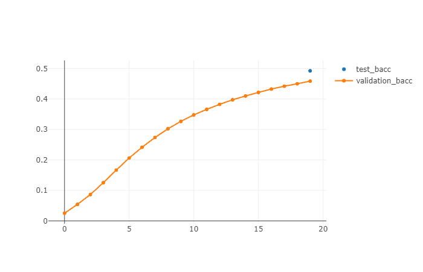
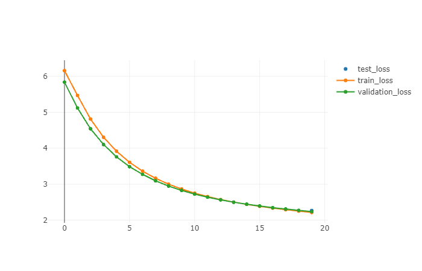

# Aprendizaje Profundo: Entrega

En este trabajo nos enfrentamos al problema de clasificación de texto del **MeLi Challenge 2019**.

El conjunto de datos tiene información acerca de títulos de publicaciones, la correspondiente categoría a predecir para cada una, información del idioma (podría ser en español o portugués), y la confiabilidad de la etiqueta.
En total, cuenta con anotaciones de títulos para 632 categorías distintas.

## **Procedimiento General**

#### Preprocesamiento
- En la notebook `preprocess_MeLi.ipynb` se aplica un preprocesamiento general a todo el conjunto de datos.
    - Se convierten los títulos de las publicaciones en vectores de índices (correspondientes a la ubicación de cada palabra en el diccionario de vocabulario), y se transforman las categorías a valores numéricos.
- Para el manejo del dataset se utilizó el script `dataset.py` donde se hereda de la clase `IterableDataset`, agregando un hiperparámetro para determinar el tamaño del buffer de pseudo-aleatorización.
- Para asegurar que todas las entradas al modelo tengan las mismas dimensiones, en el script `utils.py` se define la clase `PadSequences` para asignar la misma longitud a todos los vectores de entrada.

#### Modelos
- Se declararon tres arquitecturas generales diferentes **MLP**, **CNN**, y **RNN**, donde cada una tiene la posibilidad de ser instanciada por un conjunto de hiperparámetros.
    - Se proveen valores por defecto para cada uno de los hiperparámetros, los cuales determinan nuestros *baselines*.
- Se utilizó **MLFlow** para almacenar *logs* y resultados para cada uno de los modelos definidos, para los conjuntos de entrenamiento, validación, y evaluación.
    - Se probaron distintas combinaciones de hiperparámetros para cada arquitectura.
    - La métrica de medición era la *balanced accuracy* en el conjunto de evaluación.

#### Decisiones
- Se decidió limitar el trabajo al dataset en español, de todas maneras se puede establecer el idioma del modelo como otro hiperparámetro.
- Partiendo de los *baselines*, se intentó encontrar modelos superadores.
    - Inicialmente aplicando una búsqueda de hiperparámetros automática.
    - Finalmente aplicando una búsqueda de hiperparámetros manual.

#### Dificultades

- El conjunto de datos es demasiado grande, en consecuencia los modelos empleados también lo serán, por lo que no era posible ejecutar los experimentos en nuestras computadoras personales. 
- Al no contar con los recursos necesarios, se decidió utilizar (y compartir) el servidor provisto por la universidad para encolar tareas.
- Debido que los entrenamientos, las validaciones, y las evaluaciones eran extensas, la disponibilidad de tiempo fue muy escasa; por lo que se decidió limitar el alcance de nuestras experimentaciones.

A continuación reportaremos los resultados de nuestros experimentos, junto con algunas reflexiones y observaciones sobre la investigación realizada.

# Baselines

Existe un conjunto de hiperparámetros que se mantuvo constante durante el desarrollo de todo el trabajo.
- Los conjuntos de datos `train_data`, `validation_data`, `test_data`.
- La preparación de los *embeddings* `language`, `embeddings`.
- Los resultados del preprocesamiento `token_to_index`.

#### Hiperparámetros

| Model                | `hidden_layers`      | `dropout`            | `learning_rate`      | `weight_decay`       | `epochs`             | `batch_size`         | `freeze_embeddings`  | `filters_count`      | `filters_length`     | `lstm_layers`        | `lstm_features`      | `random_buffer_size` |
| -------------------- | -------------------- | -------------------- | -------------------- | -------------------- | -------------------- | -------------------- | -------------------- | -------------------- | -------------------- | -------------------- | -------------------- | -------------------- |
| MLP                  | (256, 128)           | 0.3                  | 0.001                | 1e-05                | 3                    | 128                  | True                 | ---                  | ---                  | ---                  | ---                  | 2048                 |
| CNN                  | (128)                | 0.0                  | 0.001                | 1e-05                | 3                    | 128                  | True                 | 100                  | (2, 3, 4)            | ---                  | ---                  | 2048                 |
| RNN                  | (256, 128)           | 0.3                  | 0.001                | 1e-05                | 3                    | 128                  | True                 | ---                  | ---                  | 3                    | 128                  | 2048                 |

#### Métricas

| Model                     | Test Balanced Acc.        | Validation Balanced Acc.  | Test Loss                 | Validation Loss           | Train Loss                | 
| ------------------------- | ------------------------- | ------------------------- | ------------------------- | ------------------------- | ------------------------- |
| MLP                       | **0.447**                 | 0.414                     | 2.768                     | 2.810                     | 2.834                     |
| CNN                       | **0.725**                 | 0.675                     | 1.220                     | 1.433                     | 1.437                     |
| RNN                       | **0.870**                 | 0.795                     | 0.574                     | 0.869                     | 0.968                     |

#### Observaciones

- Resulta evidente que nuestro mejor modelo es **RNN** (mientras que el peor es **MLP**).
- A pesar de solo ser *baselines*, se obtuvieron resultados bastante prometedores.
- Notar que varios de los hiperparámetros de los modelos coinciden en sus valores.

# Búsqueda de Hiperparámetros

Definiendo un espacio totalmente arbitrario de búsqueda, se intentó automatizar el proceso para encontrar mejores hiperparámetros.
- Se utilizó la librería `hyperopt`, y se realizó un máximo de **10** intentos por cada arquitectura.
En caso de ser necesario, se puede revisar el script correspondiente a cada modelo para verificar el espacio considerado en los experimentos.

#### Hiperparámetros

| Model                | `hidden_layers`      | `dropout`            | `learning_rate`      | `weight_decay`       | `epochs`             | `batch_size`         | `freeze_embeddings`  | `filters_count`      | `filters_length`     | `lstm_layers`        | `lstm_features`      | `random_buffer_size` |
| -------------------- | -------------------- | -------------------- | -------------------- | -------------------- | -------------------- | -------------------- | -------------------- | -------------------- | -------------------- | -------------------- | -------------------- | -------------------- |
| MLP                  | (256, 128)           | 0.2                  | 6e-04                | 1e-05                | 10                   | 514                  | False                | ---                  | ---                  | ---                  | ---                  | 2048                 |
| CNN                  | (256, 128)           | 0.4                  | 5e-05                | 1e-05                | 1                    | 514                  | False                | 100                  | (2, 3, 4, 5)         | ---                  | ---                  | 2048                 |
| RNN                  | (256, 514, 256)      | 0.4                  | 8e-05                | 1e-05                | 10                   | 128                  | True                 | ---                  | ---                  | 3                    | 128                  | 2048                 |

#### Métricas

| Model                     | Test Balanced Acc.        | Validation Balanced Acc.  | Test Loss                 | Validation Loss           | Train Loss                | 
| ------------------------- | ------------------------- | ------------------------- | ------------------------- | ------------------------- | ------------------------- |
| MLP                       | **0.932**                 | 0.875                     | 0.279                     | 0.521                     | 0.502                     |
| CNN                       | **0.563**                 | 0.522                     | 2.119                     | 1.893                     | 3.849                     |
| RNN                       | **0.675**                 | 0.600                     | 1.493                     | 1.720                     | 1.837                     |

#### Observaciones

- Notar que solo listamos el mejor modelo encontrado por cada búsqueda.
- Resulta evidente que la búsqueda no fue del todo adecuada, o al menos no brindó los resultados esperados.
    - Quizás el espacio de búsqueda era demasiado grande (muchos parámetros y muchas opciones).
    - Probablemente se realizaron muy poco intentos, y se necesitarían más para que el proceso de búsqueda comenzara a converger a mejores modelos.
    - Incluso es posible que las opciones especificadas no sean lo suficientemente buenas para encontrar un modelo convincente.
- De todas maneras, se encontró un modelo extremadamente satisfactorio de **MLP** (superando ampliamente su *baseline*).

# Experimentos Manuales

En este punto del trabajo, contamos con modelos *baseline* satisfactorios con las arquitecturas **CNN** y **RNN**, y un modelo (encontrado con una búsqueda automática de hiperparámetros) excelente con la arquitectura **MLP**.
Nuestro objetivo en esta etapa fue intentar superar los mejores desempeños para cada clase de modelo.
El procedimiento fue desesestructurado, en el sentido que no se definió una metodología precisa para la búsqueda de modelos superadores.
Principalmente nos basamos en la curiosidad de cada uno, intentando diferentes combinaciones de hiperparámetros a *prueba y error*, o realizando búsquedas automáticas mucho más acotadas en sus espacios de búsqueda.
A continuación presentamos algunos de los resultados encontrados.

## MLP: TODO

Se procedió a modificar los hiperparámetros correspondientes al MLP baseline para superar las métricas obtenidas por esta primera aproximación. Los hiperparámetros modificados fueron: `batch_size`, `epochs`, `dropout`, `learning_rate`, `hidden_layers`, `random_buffer_size` y `weight_decay`. (agregar los hiperparámetros modificados en las otras corridas)

#### Hiperparámetros

| Model                | `hidden_layers`      | `dropout`            | `learning_rate`      | `weight_decay`       | `epochs`             | `batch_size`         | `freeze_embeddings`  | `random_buffer_size` |
| -------------------- | -------------------- | -------------------- | -------------------- | -------------------- | -------------------- | -------------------- | -------------------- | -------------------- |
| MLP_1                | (800, 550, 250)      | 0.2                  | 1e-04                | 0                    | 15                   | 400                  | True                 | 1000                 |
| MLP_2                | (256, 256, 128)      | 0.2                  | 1e-05                | 1e-06                | 20                   | 520                  | True                 | 2000                 |
| MLP_3                |                      |                      |                      |                      |                      |                      |                      |                      |

#### Métricas

| Model                     | Test Balanced Acc.        | Validation Balanced Acc.  | Test Loss                 | Validation Loss           | Train Loss                | 
| ------------------------- | ------------------------- | ------------------------- | ------------------------- | ------------------------- | ------------------------- |
| MLP_1                     | **0.670**                 | 0.618                     | 1.499                     | 1.69                      | 1.673                     |
| MLP_2                     | **0.219**                 | 0.200                     | 4.007                     | 3.877                     | 3.901                     |
| MLP_3                     |                           |                           |                           |                           |                           |

#### Gráficos

Figura 1. Progresión de la métrica balanced accuracy del conjunto de validación a través de las épocas (`epochs`). a) MLP_1  (agregar las otras corridas)

Figura 2. Progresión de la función de loss del conjunto de train y de validación a través de las épocas (`epochs`). a) MLP_1 (agregar las otras corridas)    

#### Observaciones

- A partir de los resultados del primer modelo MLP_1 se puede observar que una mayor complejización del MLP baseline mejoró ampliamente la métrica de balanced accuracy en el conjunto de test, pasando de una valor de 0.447 a un valor de 0.67. Esta complejización del modelo estuvo dada por un aumento en el número de capas ocultas (`hidden_layers`) y en el número de neuronas por capa. Asimismo, tal como se observa en las Figuras, un incremento en el número de iteraciones (`epochs`) determina una aumento en el balanced accuracy del conjunto de validación (Fig. 1a), así como también, una disminución en la función de loss tanto en el conjunto de train como en el conjunto de evaluación (Fig. 2a).

## CNN: TODO

Asimismo, se modificaron los hiperparámetros correspondientes al CNN baseline con el fin de mejorar las métricas obtenidas por esta primera aproximación. Los hiperparámetros modificados fueron: `batch_size`, `epochs`, `dropout`, `learning_rate`, `hidden_layers`, `random_buffer_size`,  `weight_decay`, `filters_count` y `filters_length` . (agregar los hiperparámetros modificados en las otras corridas)

#### Hiperparámetros

| Model                 | `hidden_layers`       | `dropout`             | `learning_rate`       | `weight_decay`        | `epochs`              | `batch_size`          | `freeze_embeddings`   | `filters_count`       | `filters_length`      | `random_buffer_size`  |
| --------------------- | --------------------- | --------------------- | --------------------- | --------------------- | --------------------- | --------------------- | --------------------- | --------------------- | --------------------- | --------------------- |
| CNN_1                 | (800, 550, 250)       | 0.2                   | 1e-04                 | 1e-06                 | 10                    | 400                   | True                  | 150                   | (3, 4, 5)             | 1000                  |
| CNN_2                 | (1200, 500, 256, 128) | 0.3                   | 1e-05                 | 1e-06                 | 20                    | 600                   | True                  | 100                   | (2, 3, 4, 5)          | 2000                  |
| CNN_3                 |                       |                       |                       |                       |                       |                       |                       |                       |                       |                       |

#### Métricas

| Model                     | Test Balanced Acc.        | Validation Balanced Acc.  | Test Loss                 | Validation Loss           | Train Loss                |
| ------------------------- | ------------------------- | ------------------------- | ------------------------- | ------------------------- | ------------------------- |
| CNN_1                     | **0.762**                 | 0.704                     | 1.033                     | 1.247                     | 1.189                     |
| CNN_2                     | **0.490**                 | 0.459                     | 2.269                     | 2.237                     | 2.215                     |
| CNN_3                     |                           |                           |                           |                           |                           |

#### Gráficos

Figura 3. Progresión de la métrica balanced accuracy del conjunto de validación a través de las épocas (`epochs`).a) CNN_1 

b) CNN_2 
(agregar las otras corridas)

Figura 4. Progresión de la función de loss del conjunto de train y de validación a través de las épocas (`epochs`). a) CNN_1 (agregar las otras corridas)   

b) CNN_2 

#### Observaciones

- Al igual que en el caso del MLP, una mayor complejidad del CNN baseline, dada por un aumento en el número de capas ocultas (`hidden_layers`), en el número de neuronas por capa y en el número (`filters_count`) y tamaño de los filtros (`filters_length`), determinó un incremento en el balanced accuracy del conjunto de test en el modelo CNN_1. Sin embargo, este aumento en la performance del modelo no fue muy importante, pasando de un valor de 0.725 a un valor de 0.762. Es posible que el incremento en el número de capas, neuronas y filtros no sea un factor clave en la mejora del modelo, ya que a diferencia del CNN baseline, se incorporó el `dropout` que controla el overfitting que podría generar el aumento en el número de estos hiperparámetros. Asimismo, el incremento en el número de `epochs` determinó un aumento en el balanced accuracy del conjunto de validación (Fig. 3a) y una disminución en la función de loss tanto en el conjunto de train como en el conjunto de evaluación (Fig. 4a).  

## RNN

#### Hiperparámetros

| Model                 | `hidden_layers`       | `dropout`             | `learning_rate`       | `weight_decay`        | `epochs`              | `batch_size`          | `freeze_embeddings`   | `lstm_layers`         | `lstm_features`       | `random_buffer_size`  |
| --------------------- | --------------------- | --------------------- | --------------------- | --------------------- | --------------------- | --------------------- | --------------------- | --------------------- | --------------------- | --------------------- |
| RNN_1                 | (256, 128)            | 0.2                   | 1e-05                 | 1e-06                 | 20                    | 300                   | True                  | 4                     | 128                   | 2000                  |
| RNN_2                 | (1200, 500, 256, 128) | 0.3                   | 1e-05                 | 1e-06                 | 20                    | 600                   | True                  | 10                    | 128                   | 2000                  |
| RNN_3                 | (256, 128)            | 0.1                   | 1e-03                 | 1e-05                 | 10                    | 1024                  | False                 | 3                     | 256                   | 2048                  |

#### Métricas

| Model                     | Test Balanced Acc.        | Validation Balanced Acc.  | Test Loss                 | Validation Loss           | Train Loss                | 
| ------------------------- | ------------------------- | ------------------------- | ------------------------- | ------------------------- | ------------------------- |
| RNN_1                     | **0.363**                 | 0.326                     | 3.080                     | 3.080                     | 3.230                     |
| RNN_2                     | **0.002**                 | 0.002                     | 6.636                     | 6.296                     | 6.636                     |
| RNN_3                     | **0.946**                 | 0.889                     | 0.236                     | 0.474                     | 0.236                     |

#### Gráficos

Gráfico de la pérdida según las épocas para el modelo **RNN_3**, en validación y entrenamiento.

Gráfico del desempeño según las épocas para el modelo **RNN_3**, en validación.

#### Observaciones

- La red **RNN_1**, a pesar de ser similar al modelo *baseline*, obtiene un desempeño pésimo. Quizás sucede alguna de las siguientes situaciones.
    - El parámetro `learning_rate` es muy bajo, por lo que la red no aprende (*underfitting*).
    - El parámetro `epochs` es muy alto, y la red aprende demasiado (*overfitting*).
- La red **RNN_2**, ampliamente la más compleja, obtiene el peor de todos los desempeños. Claramente algo está fallando en su entrenamiento.
- La red **RNN_3**, obtenida por una búsqueda automática más refinada, consigue los mejores resultados de nuestra experimentación. Es posible que el parámetro `batch_size` sea una de las causas.

# Conclusión: TODO

...
